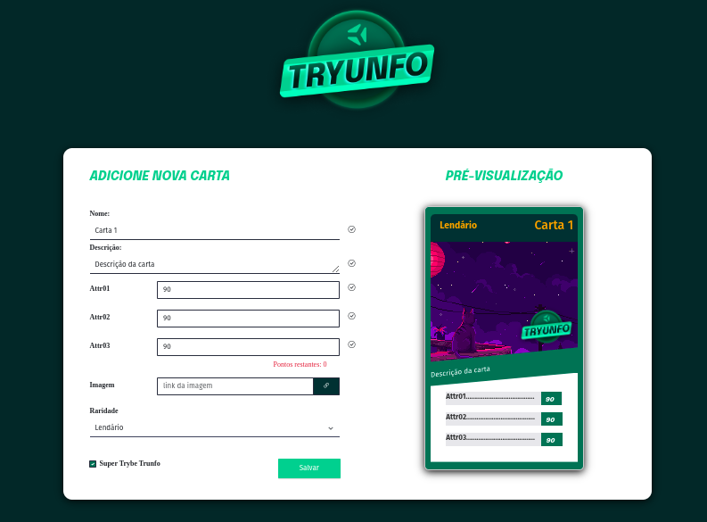
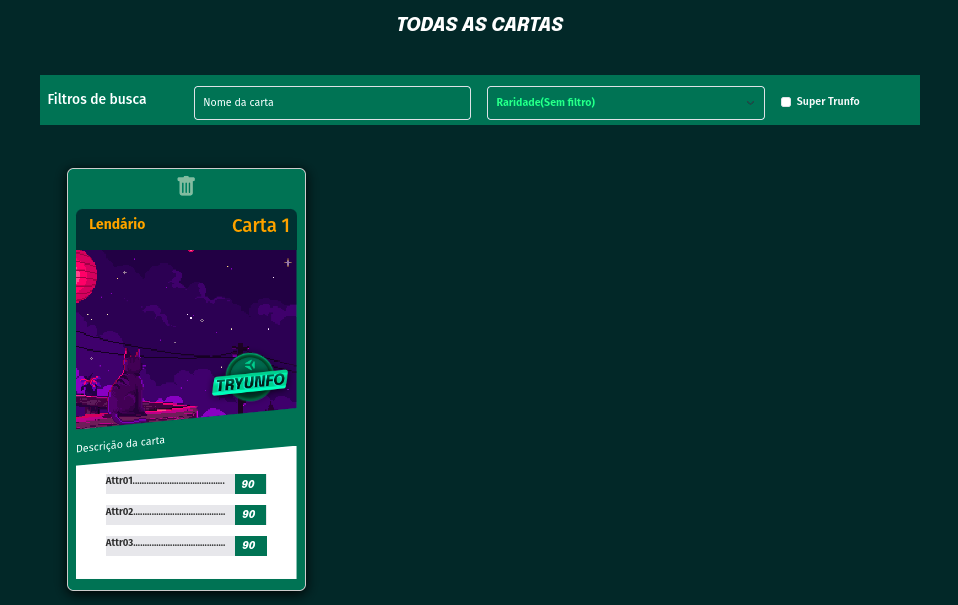

# Tryunfo 


## Pré-Visualização do Projeto

### Veja a aplicação funcionando [clicando aqui  ](https://isaque-s-0liveira.github.io/Tryunfo-FE-Updated/)

<div style="display:flex; justify-content:center;  align-items:center; width="100%">
  
  
</div>


# Contexto
Este projeto trata-se de um jogo no estilo Super Trunfo! Ao utilizar essa aplicação uma pessoa usuária é capaz de:

- Criar um baralho com o tema livre;

- Adicionar e remover uma carta do baralho;

- Visualizar todas as cartas que foram adicionadas ao baralho;

- Realizar filtros para encontrar cartas específicas;
  

## Habilidades Demonstradas

Neste projeto, foram utilizadas as seguintes habilidades:

- Leitura do estado de um componente e utilização para alterar a exibição no navegador.
- Inicialização de um componente, atribuindo a ele um estado pré-definido.
- Atualização do estado de um componente.
- Captura de eventos utilizando a sintaxe do React.
- Criação de formulários utilizando a sintaxe TSX com as tags: input, textarea, select, form, checkbox.
- Transmissão de informações de componentes filhos para componentes pais via callbacks.


## Técnologias usadas

Front-end:
- [React](https://reactjs.org/)
- [TypeScript](https://www.typescriptlang.org/)
- [Context API](https://reactjs.org/docs/context.html)
- [Bootstrap 5](https://getbootstrap.com/)
- CSS3

## Executando aplicação

* Clone o repositório:
  ```
    git clone git@github.com:isaque-S-0liveira/Tryunfo-FE-Updated.git
  ```
* Entre na pasta do repositório que você acabou de clonar:

  ```
    cd Tryunfo-FE-Updated/
  ```
* Instale as dependências:
  ```
    npm install
  ```

* Inicialize a aplicação com o comando: 
  ```
    npm run dev
  ```


